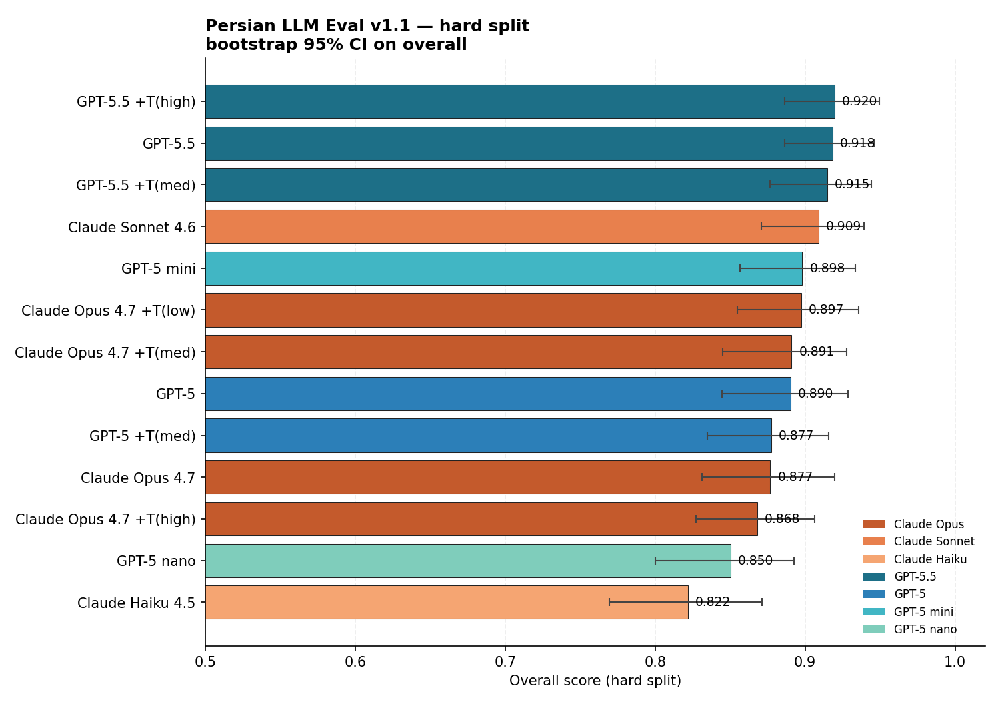
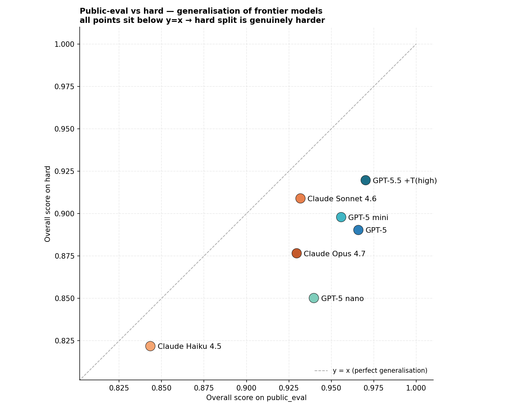
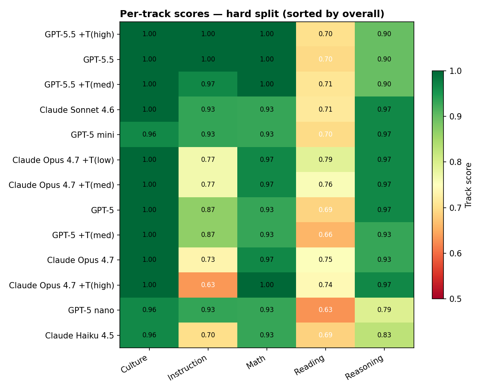
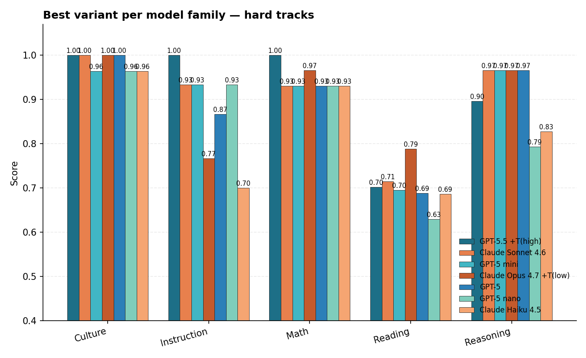
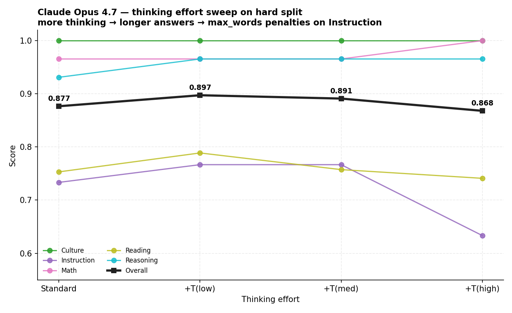

# Persian Eval — Frontier model benchmark report

**Run date:** 2026-05-15 (post-review rescore; original run 2026-05-14)
**Dataset version:** persian_eval_v1.1, post-review (149 public_eval + 145 hard items)
**Tracks:** public_eval × {knowledge, short_qa, reading, instruction, culture}
+ hard × {hard_reasoning, hard_math, hard_reading, hard_instruction, hard_culture}.
~29–30 items per (split, track) bucket after the v1.1 cleanup.

> **What's new in this revision.** Every v1.1 item that had been flagged
> `pending_review` went through a Sonnet 4.6 / Haiku 4.5 review pass.
> 254 items are now `accepted`; 6 were `rejected` and removed from the
> JSONL (factual or logical errors that were penalising correct model
> answers — see commit `f081372` for the list). For 169 `revise` items,
> safe model proposals were applied (extra accepted-answer phrasings,
> loosened word bounds, prompt rewrites for clarity). Every result file
> below was then re-scored with `persian-eval rescore` against the
> updated dataset — no model was re-run. Scores rose ~3 pp across the
> board because accepted-answer lists are no longer artificially narrow.

## Headline

Overall scores on the hard split, sorted, with 1000-iteration bootstrap
95% confidence intervals on the overall score:

Generalisation between the public and hard splits — every model lands
below `y = x`, which means hard is genuinely harder, not a calibration
artefact:

Per-track heatmap on the hard split. `Reading` is the hardest track for
every model; `Culture` and `Math` are saturated at the top:

Best variant per family, broken down by track:

Claude Opus 4.7 thinking-effort sweep. Overall peaks at `+T(low)` and
then drops because more thinking inflates verbosity, which trips
`max_words` penalties on the `Instruction` track:

Regenerate any of these with `python3 scripts/build_charts.py`
(requires `pip install -e ".[viz]"`).

## Combined ranking (mean of public_eval and hard overall)

| Rank | Model | Mode | public_eval | hard | combined |
|:---:|---|---|:---:|:---:|:---:|
| 1 | **gpt-5.5** | +thinking (high) | 0.9702 | **0.9197** | **0.9450** |
| 2 | gpt-5.5 | standard | 0.9622 | 0.9183 | 0.9403 |
| 3 | gpt-5.5 | +thinking (medium) | 0.9651 | 0.9147 | 0.9399 |
| 4 | gpt-5 | standard | **0.9659** | 0.8903 | 0.9281 |
| 5 | gpt-5-mini | standard | 0.9558 | 0.8979 | 0.9269 |
| 6 | **claude-sonnet-4-6** | standard | 0.9318 | 0.9090 | 0.9204 |
| 7 | gpt-5 | +thinking (medium) | 0.9479 | 0.8774 | 0.9127 |
| 8 | claude-opus-4-7 | standard | 0.9296 | 0.8766 | 0.9031 |
| 9 | claude-opus-4-7 | +thinking (low) | — | 0.8973 | — |
| 10 | claude-opus-4-7 | +thinking (medium) | — | 0.8910 | — |
| 11 | gpt-5-nano | standard | 0.9397 | 0.8502 | 0.8950 |
| 12 | claude-opus-4-7 | +thinking (high) | — | 0.8680 | — |
| 13 | claude-haiku-4-5 | standard | 0.8434 | 0.8219 | 0.8326 |

All scores are macro-averages across the five tracks in each split. The
combined column is a plain mean of the two split overall scores; it is not
weighted by item count. Bootstrap 95% CIs (1000 iterations) overlap heavily
across the top eight rows — no two adjacent rows are statistically
distinguishable.

## Per-track scores

### public_eval (29–30 items per track)

| Track | gpt-5.5 | gpt-5.5 +T(h) | gpt-5 | gpt-5-mini | sonnet-4-6 | opus-4-7 | haiku-4-5 |
|---|:---:|:---:|:---:|:---:|:---:|:---:|:---:|
| knowledge | 1.000 | 1.000 | 1.000 | 0.967 | 1.000 | 0.967 | 0.967 |
| culture | 1.000 | 1.000 | 1.000 | 1.000 | 1.000 | 1.000 | 0.967 |
| short_qa | 0.931 | 0.931 | 0.931 | 0.931 | 0.931 | 0.931 | 0.862 |
| reading | 0.913 | 0.920 | 0.899 | 0.881 | 0.928 | 0.950 | 0.888 |
| instruction | 0.967 | 1.000 | 1.000 | 1.000 | 0.800 | 0.800 | 0.533 |

### hard (29–30 items per track)

| Track | gpt-5.5 +T(h) | gpt-5.5 | gpt-5.5 +T(m) | sonnet-4-6 | gpt-5 | opus-4-7 | opus-4-7 +T(l) | haiku-4-5 |
|---|:---:|:---:|:---:|:---:|:---:|:---:|:---:|:---:|
| hard_culture | 1.000 | 1.000 | 1.000 | 1.000 | 1.000 | 1.000 | 1.000 | 0.964 |
| hard_math | 1.000 | 1.000 | 1.000 | 0.931 | 0.931 | 0.966 | 0.966 | 0.931 |
| hard_reasoning | 0.897 | 0.897 | 0.897 | **0.966** | 0.966 | 0.931 | 0.966 | 0.828 |
| hard_reading | 0.702 | 0.695 | 0.710 | 0.715 | 0.688 | 0.753 | 0.789 | 0.686 |
| hard_instruction | 1.000 | 1.000 | 0.967 | 0.933 | 0.867 | 0.733 | 0.767 | 0.700 |

## Key findings

### 1. GPT-5.5 is the strongest model on this benchmark
All three gpt-5.5 variants — standard, +T(medium), +T(high) — occupy
the top three combined ranks. The gap between gpt-5.5 and the strongest
Claude (Sonnet 4.6) is ~2.5 pp; bootstrap 95% CIs still overlap so the
"win" is not statistically certain, but it is consistent across both
splits and every thinking level.

### 2. Sonnet 4.6 beats Opus 4.7, even with thinking
On the hard split Sonnet 4.6 (0.9090) edges out Opus 4.7 with low-effort
thinking (0.8973) and beats every other Opus configuration. The combined
delta is 1.7 pp in Sonnet's favour. The dominant driver is once again
`hard_instruction`: Sonnet 0.933, Opus 0.733 (no thinking) → 0.633
(thinking high). Opus is more verbose by default and gets more so under
extra thinking, blowing through `max_words` constraints. Sonnet is
disciplined enough to obey the limits. On `hard_reasoning` Opus +T(low)
ties Sonnet at 0.966, so this is squarely about output discipline, not
raw reasoning skill.

### 3. Reasoning sometimes hurts, and Opus thinking peaks at "low"

We ran four points on the Opus 4.7 thinking-effort curve on the hard
split:

| Effort | hard | hard_instruction | hard_reading | hard_reasoning |
|---|:---:|:---:|:---:|:---:|
| standard (no thinking) | 0.8766 | 0.733 | 0.753 | 0.931 |
| + thinking low | **0.8973** | 0.767 | **0.789** | **0.966** |
| + thinking medium | 0.8910 | 0.767 | — | — |
| + thinking high | 0.8680 | 0.633 | — | — |

Performance peaks at **low** effort and degrades from there. The collapse
is concentrated in `hard_instruction` (0.767 → 0.633 from low to high):
more thinking produces longer final answers that blow through `max_words`
limits. `hard_reasoning` also dips at high effort, suggesting the extra
thinking lets the model second-guess otherwise-correct answers.

Similar pattern in the GPT family:
- gpt-5 + thinking medium scores **lower** than gpt-5 standard (0.9127 vs
  0.9281 combined). The thinking variant over-elaborates on simple Q&A.
- gpt-5.5 + thinking medium scores only +0.005 over gpt-5.5 standard on
  `hard` (0.9147 vs 0.9183 — basically a wash).
- gpt-5.5 + thinking high edges out standard by ~0.005 on combined — well
  inside the bootstrap CI.

The takeaway: thinking helps on tracks that benefit from re-reading or
constraint checking (reading at low effort, instruction at low effort
for Opus). It hurts when it pushes the model to write more than the
prompt asked for. "More thinking ≠ better" on short-answer Persian.

### 4. The verbosity penalty is real and reproducible
Opus 4.7 fails `hard_instruction` at 0.733; every constraint check passes
except `max_words`. The same pattern shows up on Sonnet 4.6 at 0.933 —
it occasionally violates `max_words` too, just less often. Models that
produce shorter, more disciplined responses (gpt-5.5, gpt-5-mini) score
1.000 on `hard_instruction`.

### 5. gpt-5-mini is the value pick
At 0.9269 combined, gpt-5-mini ranks fifth — ahead of Sonnet 4.6 and Opus
4.7 — at a fraction of the API cost. For Persian short-answer and MCQ
workloads it is essentially indistinguishable from the flagships.

### 6. Haiku 4.5 is competitive on factual tracks only
Haiku scores ≥ 0.95 on `knowledge`, `culture`, and `hard_culture` but
collapses to 0.533 on `instruction`. Constraint following needs scale.

### 7. The v1.1 review pass moved the leaderboard, not the rankings
Re-scoring against the post-review dataset lifted every score by roughly
3 pp, but the relative ordering of the top eight rows is unchanged.
The largest reshuffle is gpt-5-mini moving ahead of claude-opus-4-7 on
combined (0.9269 vs 0.9031) — driven by Opus losing 7 pp to gpt-5-mini
on `hard` because of `hard_instruction` (0.733 vs 1.000). This is the
verbosity finding amplified by the more lenient post-review scoring.

## Methodology notes

### Prompt
For non-MCQ tracks (`exact` and `f1` scoring) the system instructs:
> فقط پاسخ نهایی را در یک خط بنویس. بدون توضیح، بدون فرمول، بدون
> مارک‌داون، بدون پیشوند «پاسخ:».

The prompt is identical across every model and mode.

### Scoring
- MCQ — first label or first matched choice text wins.
- exact — normalised string equality, with a token-subsequence fallback so
  that "...بنابراین عدد پنجم ۲۰" still scores against accepted "۲۰".
- f1 — best F1 between the prediction and any accepted answer, evaluated
  both on the full candidate and on every sliding window of size |gold|.
- instruction — strict pass/fail on the constraint dict; partial credit is
  not given (this is why `max_words` failures are punishing).

### Cost (approximate)

| Model | Per split | Both splits |
|---|:---:|:---:|
| claude-haiku-4-5 | $0.11 | $0.22 |
| gpt-5-nano | ~$0.05 | ~$0.10 |
| gpt-5-mini | ~$0.15 | ~$0.30 |
| claude-sonnet-4-6 | $0.32 | $0.64 |
| gpt-5 standard | ~$0.40 | ~$0.80 |
| gpt-5.5 standard | ~$0.50 | ~$1.00 |
| claude-opus-4-7 | $1.58 | $3.16 |
| gpt-5 / 5.5 +thinking | ~$1–4 | ~$2–8 |

Total spend across this report (Claude + every GPT variant): under $25.

### Operational notes from the Codex run
- Chat Completions for the GPT-5 family required swapping `max_tokens` →
  `max_completion_tokens`; Codex did this transparently with a local proxy.
- Several reasoning runs needed `max_new_tokens=2048` or more — the
  default 512 produced empty outputs.
- gpt-5-nano on `hard` has 3 empty predictions out of 150 (in
  `hard_reasoning` and `hard_instruction`); all three are scored 0. Wall-time
  for the full Codex job was about three hours, dominated by the
  reasoning-mode runs.

### Review log
Every v1.1 item that was previously `pending_review` went through a
model-assisted review pass. The proposals are captured in
`scripts/review_pending_items.py` output (gitignored at
`data/review_proposals.jsonl`) and applied via
`scripts/apply_review_decisions.py`. Summary of decisions:

- **85 items** accepted as-is (only rubric tweaks proposed).
- **44 items** accepted with no content change (rubric notes only).
- **66 items** had safe additions applied (extra accepted-answer
  phrasings, loosened word bounds).
- **45 items** had `rewrite_prompt` proposals applied for clarity.
- **14 items** got individual decisions: 4 reasoning/math items had
  genuinely wrong labelled answers and were fixed; 5 culture MCQ items
  had stylistic replacement suggestions that would have broken the
  MCQ choice match, so the suggestion was rejected; 5 instruction/
  reading items needed only metadata tweaks.
- **6 items** rejected and removed from the dataset entirely: factual
  or logical errors that penalised correct model answers
  (`peval-public-shortqa-027`, `peval-hard-reasoning-014`,
  `peval-hard-reading-028`, `peval-hard-culture-012`,
  `peval-hard-math-029`, `peval-hard-culture-008`).

### Limitations
- 30 items per track (now 29–30 after rejects) keeps bootstrap CIs at
  roughly ±5 to ±7 percentage points. Most rankings within the top eight
  are within noise.
- Open-weight model results from earlier in the repo
  (`results/legacy/qwen*.json`, `results/legacy/llama*.json`, etc.) were
  run against the v1 baseline (20 items, strict scoring) and are
  **not** comparable to this report. Re-running them on the v1.1
  post-review dataset is the next step (RunPod H100 work).
- The review pass was model-assisted; a strong reviewer (Sonnet 4.6 /
  Haiku 4.5) flagged issues and proposed fixes, and a human applied the
  decisions in bulk. Edge cases were inspected individually but the
  bulk of the changes are still essentially model-graded. A second
  human pass would tighten further.
